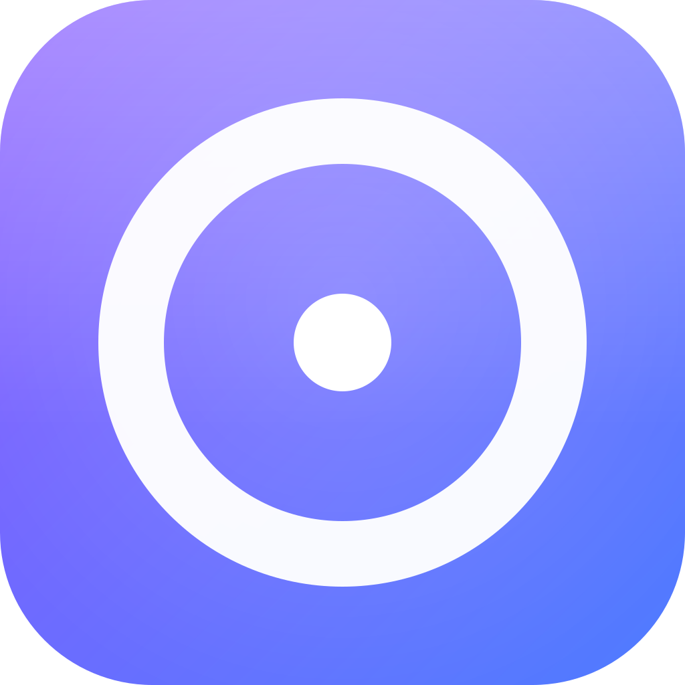

# FocusArx Brand

The FocusArx identity is the **iris mark**: a liquid-glass squircle in the
brand iris gradient (violet → azure) holding a calm focus reticle — a precise
ring with a luminous center point. It reads as *focus made visible*: one
thing, centered, in the light.

## The mark

| | |
|---|---|
| **Tile** | Rounded squircle, corner radius **22.3%** of canvas (Apple-icon geometry) |
| **Gradient** | Iris: `#8A5CFF` (violet, NW) → `#4E7CFF` (azure, SE) |
| **Reticle** | Ring radius **0.309 × canvas**, stroke **0.096 × canvas**, white; dot radius **0.071 × canvas** |
| **Specular** | White sheen fading by 42% down the tile + soft center glow |

The reticle glyph (white strokes, transparent field, 24-unit grid) lives in
[`artifacts/focusarx/public/brand/focusarx-glyph.svg`](../artifacts/focusarx/public/brand/focusarx-glyph.svg)
for use on neutral surfaces (buttons, docs). Use `currentColor` when
inlining — the glyph inherits its surface.

## Assets

- **Authoring source:** `artifacts/focusarx/public/brand/focusarx-mark.svg`
  (single source of truth for geometry).
- **Raster generation:** `artifacts/focusarx/scripts/generate-brand-assets.sh`
  (ImageMagick, pure primitives, no rsvg). After editing the SVG, run it and
  commit the refreshed PNGs:
  `favicon.png`, `icon-180.png`, `icon-192.png`, `icon-512.png`,
  `icon-maskable-512.png`, `logo.png`, `opengraph.jpg`.
- **UI component:** `artifacts/focusarx/src/components/ui/brand.tsx` —
  `BrandMark` (tile + reticle, CSS-drawn via `.brand-mark`), `BrandGlyph`,
  `BrandLockup` (mark + wordmark ± tagline), `BrandWordmark`.
- **CSS surface:** `.brand-mark` in `artifacts/focusarx/src/index.css` — the
  gradient/radius/specular tokens must stay in lockstep with the SVG.

## Usage

- The lockup is `BrandLockup` → mark + **FocusArx** wordmark
  (SF Pro / system font stack, semibold, tight tracking). The tagline is
  *Deep work, made clear* (app) or a context label such as *Console* /
  *Developer tools* (internal tools).
- Mark-only is for favicons, launchers, avatar slots and compact mobile
  headers.
- The mark always sits on its own iris tile. Do **not** recolor the tile
  gradient, rotate the reticle, add text inside the tile, or drop the mark
  into non-square frames without keeping the tile's corner ratio.
- On dark materials the reticle may render in the tile as shipped; on flat
  brand surfaces (chips, buttons) the glyph alone is fine at ≥ 50% surface
  contrast.

## Wordmark

The wordmark is typeset in the product font stack (`-apple-system` first) —
never a logo font. Tracking tight, weight 600, sentence case. On dark
backgrounds use `#FFFFFF`; on light, `#0F172A`; secondary context lines use
`--foreground-subtle`.
